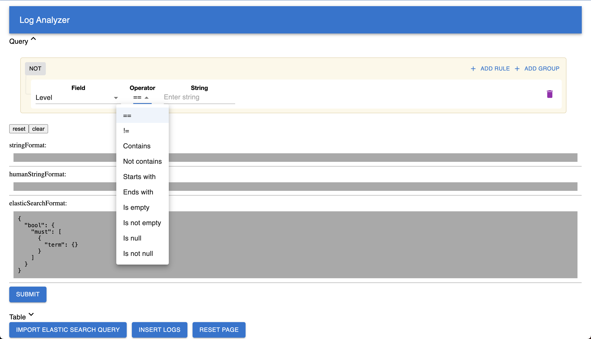
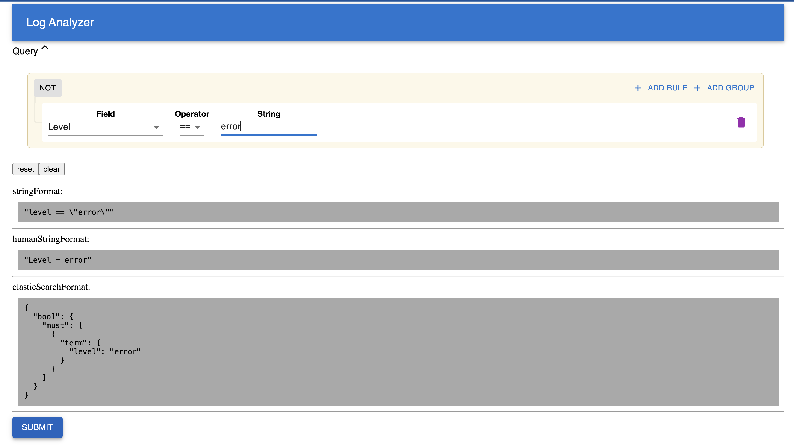

# How to Run the application and understanding its intricacies

## Running the Application
### Prerequisites:
- Ensure an active internet connection.
- [Install Docker and Docker Compose](https://thetechcruise.com/afa67942c10e46dcb5ed44327eb4482f).

### Steps:
- Clone the Repository:
    ```bash
    git clone <repository-url>
    cd <repository-folder> 
- Start the Application:
   ```bash
  docker-compose up es01 -d
  docker-compose up -d
- Ensure that all the containers are running and there are no errors in the connectivity (check logs for errors)

### Log Ingestion
To ingest logs into the system:
- The API is designed with endpoints to accept logs in the specified format.
- Alternatively, the logs can also be ingested from the UI.
- Refer to the Postman collection for detailed information on how to send logs to the system.
- Alternatively, consult the OpenAPI Specification (OAS) or access the Swagger documentation for detailed usage instructions and examples.

### Using the Log Analyzer
Once the application is up and running:

- Access the Application: 
  - Open a web browser and navigate to http://localhost:80/ (modify the port if needed as per the Docker configuration).
  - 

- Filtering and Querying Logs:
  ```
  !Important! - Not all filters available can yield in a successful Elastic Search Query. It is thus important to take a look at the generated query and see if it matches the requirements.
  ```
  - The home screen offers an intuitive interface to add filters and visualize queries in real-time.
  - Users can add multiple filters (filter rules and groups) as needed.
  - Different combinations of operations are available based on selected fields.
  - Combining filter rules/groups allows complex operations to be constructed.
  - It is also possible to view the generated queries based on the user selected filter and is displayed in three formats
    - A simple and generic string representation
    - A human understandable formatted string representation of filters
    - Elastic Search Query JSON 
  

- Query Submission and Results:
  - After setting up filters, click the submit button.
  - This action populates a paginated data-grid beneath the query block, showcasing log results.
  - Users have the flexibility to adjust columns, resize them, and apply local filtering or sorting on the displayed logs.

- Importing Elasticsearch Query JSON:
  - An import button allows users to paste Elasticsearch Query JSON directly to view logs.
  - This feature facilitates users who are familiar with Elasticsearch Query DSL to leverage their query constructs.

- Resetting the Interface:
  - Use the reset button for a complete hard-reset by refreshing the page, clearing all filters and queries.
## About the project

This project is a miniature version of a scalable and reliable Log ingestion and Analytics platform.
In its current scope some of its capabilities are -
- Blazing fast read speeds by leveraging ElasticSeach underneath
- Simple and familiar way to "POST" logs over HTTP 
- De-coupled architecture and a well-thought through design
- Follows the basic prinicples of Cloud, and CICD for infinite scaling
- A modular approach to solving one problem at a time
  
### Implemented features (for evaluation):
- All basic features 
  - Offer a user interface (Web UI or CLI) for full-text search across logs.
  - Include filters based on:
    - level
    - message
    - resourceId
    - timestamp
    - traceId
    - spanId
    - commit
    - metadata.parentResourceId
  - Aim for efficient and quick search results.
- Advanced features
  - Implement search within specific date ranges.
  - Utilize regular expressions for search (by using contains operator)
  - Allow combining multiple filters.
  
## System Design

### System components
- **Log Ingestion Service:** 
  - Responsible for receiving logs via HTTP requests.
  - Validates, processes, and stores logs efficiently.
- **Storage Layer:** 
  - Utilizes Elasticsearch for storing and indexing log data.
  - Ensures fast retrieval and query operations.

- **Query Interface:** 
  - Provides a user interface (Web UI or CLI) to interact with log data.
  - Accepts user-defined queries and filters. Translates user queries into Elasticsearch-compatible queries.

- **API Layer:** 
  - Powered by Python and Flask.
  - Handles incoming HTTP requests, manages endpoints for log ingestion, and query operations.

- **Frontend:** 
  - React-based interface offering a user-friendly environment.
  - Renders logs, query builders, and filters.
Translates user actions into API requests for querying logs.

- **Dockerization:**
  - Encapsulates each component into containers for consistency and ease of deployment.
  - Orchestrated using Docker Compose for managing the system as a whole.

### System Interaction Flow:

- **Log Ingestion:**
  - Logs are sent via HTTP POST requests to the Log Ingestion Service.
  - Validation and processing of logs occur before storage in Elasticsearch.

- **Data Storage:**
  - Log data is stored and indexed in Elasticsearch for rapid retrieval.

- **Query Interface Operation:**
  - Users interact with the Query Interface via the frontend.
  - User-defined queries and filters are translated into Elasticsearch-compatible queries.

- **API Operations:**
  - Python-based API layer processes incoming requests.
  - Handles log ingestion and query requests by interacting with Elasticsearch.

- **Frontend-Backend Interaction:**
  - Frontend sends user queries and filter configurations to the API layer.
  - API processes these requests, generates Elasticsearch queries, and retrieves log data.

- **Elasticsearch Interaction:**
  - Elasticsearch receives query requests from the API layer and retrieves logs based on the queries.
  - Returns search results to the API layer for further processing and presentation.
  
## Technologies and Design Decisions
The development process emphasized building a system that offers reliability, scalability, and testability. Key considerations were:

- Initial Concept Exploration:
  - The initial plan involved AWS Lambda functions, SNS, and Elasticsearch. However, due to challenges in project sharing over Git, alternate approaches were explored.
- Focus on Speed and Agility:
  - Core design decisions revolved around optimizing user access to logs, reducing latency, and simplifying event flow.
- Database Selection:
  - Considering the structured data, SQL or document databases were viable options. 
  - Elasticsearch was chosen for its indexing capabilities, robust distributed system, and open-source nature.

- API Layer Development:
  - Python with Flask was preferred over Node.js or Go due to familiarity, expertise, and rapid development speed. Efforts were made to minimize overhead within the Flask application.
  - Development adhered to the [OpenAPI Specification (OAS)](https://thetechcruise.com/0a3cf1f0df1544cda89a876a9002b85d) to align with API requirements.
- Handling GET Requests:
  - A critical yet challenging decision was managing the complexity of creating search queries on the client side while minimizing Python's role.
  - Sending a JSON object via request.body with a GET request could lead to functionality issues in some environments due to proxy servers or firewalls. To overcome this:
  - The query was converted to a compressed and URL-encoded string to avoid potential query-breaking issues.
  - This optimized the query size, reduced bandwidth consumption, and enabled using the query as a cache key for potential caching strategies to enhance read speeds.

- Integration and Testing Automation:
  - Leveraging [Faker](https://thetechcruise.com/6217324f4c604e4aad5e9998925a46c2) facilitated automated log ingestion, a crucial aspect of system integration and testing.

- Docker Implementation:
  - Docker played a pivotal role in ensuring the system's consistency during evaluation.
  - Docker Compose simplified the deployment process, enabling a seamless setup of the entire system.
  
This meticulous approach in technology selection and design strategy aimed to achieve optimal performance, maintainability, and scalability while addressing critical challenges in log ingestion and analysis.

## Future Scope
- Implementing a mechanism to improve read-speeds by means of Caching or by maintaining a dual-index (active, passive)
- Implementing more user-friendly interface
- Enabling live logs over WebSockets/Long-Polling/WebAssembly/Polling
- Improved API design and testing
- Share query -> necessary to simplify querying logs in real-world scenarios
- Leveraging OpenAPI generated clients for further speed of development
## Conslusion
The Log Ingestor and Query Interface project embodies a scalable and efficient solution for handling extensive log data. With a focus on high-speed log retrieval and a user-friendly query interface, this project offers a glimpse into a robust log analytics platform.

Built upon a foundation of Elasticsearch for swift data retrieval, Python and Flask for API development, and a dockerized environment for consistency and ease of deployment, the project aligns with cloud principles and CI/CD methodologies.

The implemented features encompass basic functionalities like text-based log searches and essential attribute filters, while the advanced capabilities extend to date range searches, regular expression-based operations, and composite filter combinations, enabling users to conduct precise and intricate log queries.

The README serves as a guide to running the application, ingesting logs via APIs, utilizing the log analyzer interface effectively, and understanding the technology choices and design decisions behind this project.

Overall, this project's design, functionality, and emphasis on scalability and efficiency showcase its potential as a foundational framework for a comprehensive log ingestion and analytics system.

